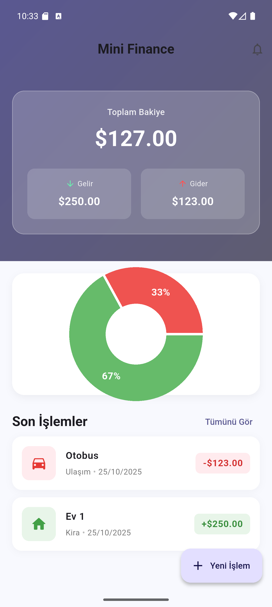
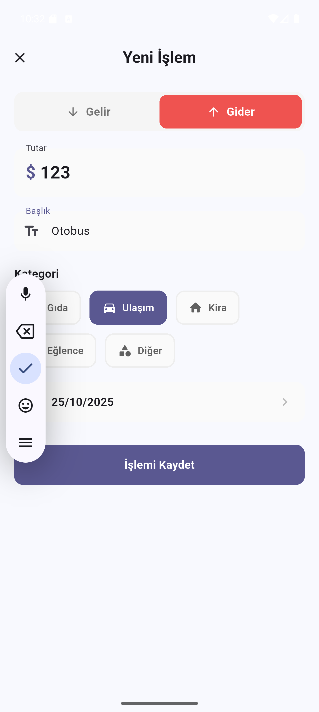

# 💰 Mini Finance App

Kişisel finans yönetimini kolaylaştıran, gelir ve giderlerinizi takip etmenizi sağlayan basit ama güçlü bir Flutter uygulaması.  
Uygulama **Bloc (Cubit) mimarisi** ile inşa edilmiştir ve veriler **Hive** lokal veritabanında saklanır.

---

## 🚀 Özellikler

- ✅ **Gelir ve gider ekleme**  
- 📅 **Tarih seçimi** ile işlem zamanı belirleme  
- 🏷️ **Kategori seçimi** (Gıda, Ulaşım, Kira, Eğlence, Diğer)  
- 💹 **Aylık / haftalık analiz grafikleri**  
- 📦 **Lokal veri saklama (Hive)**  
- 🌙 **Basit, modern ve responsive arayüz**

---

## 🧩 Kullanılan Teknolojiler ve Paketler

| Paket | Açıklama |
|-------|-----------|
| [flutter_bloc](https://pub.dev/packages/flutter_bloc) | Uygulama durum yönetimi için Cubit yapısı kullanıldı. |
| [hive_flutter](https://pub.dev/packages/hive_flutter) | Lokal veritabanı olarak kullanıldı. Hızlı ve kolay kullanımlı bir NoSQL veritabanıdır. |
| [uuid](https://pub.dev/packages/uuid) | Her işlem (transaction) için benzersiz ID oluşturmak için kullanıldı. |
| [fl_chart](https://pub.dev/packages/fl_chart) | Gelir-gider dağılımını grafiklerle görselleştirmek için kullanıldı. |
| [intl](https://pub.dev/packages/intl) | Tarih biçimlendirme ve locale destekleri için kullanıldı. |

---

## 🏗️ Mimari Yapı

Uygulama **Bloc Cubit (Business Logic Component)** mimarisi ile geliştirilmiştir.

lib/
├── core/
│ └── constants/
│ └── app_colors.dart # Uygulama renk sabitleri
│
├── cubit/
│ └── transaction_cubit.dart # Transaction (gelir/gider) state yönetimi
│
├── data/
│ ├── models/
│ │ └── transaction.dart # Hive modeli
│ └── db/
│ └── transaction_db.dart # Hive veritabanı işlemleri
│
├── presentation/
│ ├── pages/
│ │ ├── home_page.dart # Ana sayfa
│ │ └── add_transaction_page.dart # Yeni işlem ekleme sayfası
│ └── widgets/
│ └── transaction_list_item.dart # Liste eleman bileşeni
│
└── main.dart # Uygulama girişi

---

## ⚙️ Kurulum

1️⃣ Depoyu klonla  
```bash
git clone https://github.com/kullanici_adi/mini_finance_app.git
flutter pub get
flutter packages pub run build_runner build
flutter run

---


